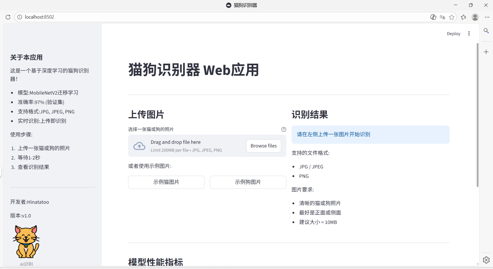
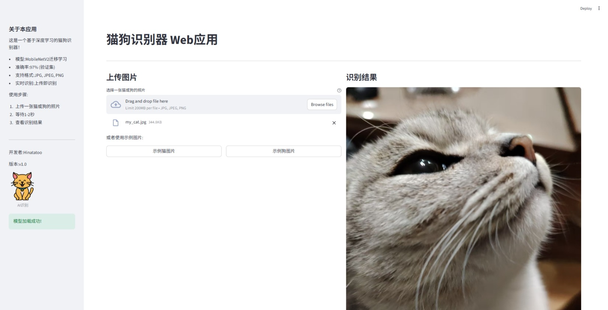

# 🐱🐶 猫狗图像分类器



> 这是我的第一个机器学习项目，从零开始实现了猫狗图片的识别，最终准确率达到 **97%**！

## 📋 项目概述

| 项目信息 | 说明 |
|---------|------|
| **目标** | 区分猫和狗的图片 |
| **数据** | Kaggle猫狗数据集（20,000张图片） |
| **模型** | MobileNetV2迁移学习 |
| **准确率** | **97%**（验证集） |
| **部署** | Streamlit Web应用 |

---

## 🎯 模型性能对比

| 模型版本 | 准确率 | 特点 |
|---------|--------|------|
| 基础CNN (5轮) | 71.92% | 第一个尝试，快速验证 |
| 基础CNN (30轮) | 81.73% | 增加训练轮次，小幅提升 |
| **迁移学习 (MobileNetV2)** | **97.00%** | ⭐ 使用预训练模型，效果最佳 |

---

## 🖼️ 识别效果展示



*上传你的宠物照片，AI 就能准确识别！*

---

## 🚀 快速开始

### 环境要求
- Python 3.8+
- pip

### 安装步骤

1. **克隆仓库**
```bash
git clone https://github.com/Hinatatoo/cat-dog-classifier.git
cd cat-dog-classifier

2.创建虚拟环境（推荐）

bash
python -m venv ml_env
.\ml_env\Scripts\activate  # Windows
source ml_env/bin/activate  # Mac/Linux
3.安装依赖

bash
pip install -r requirements.txt
4.运行Web应用

bash
streamlit run app.py
浏览器会自动打开，开始识别猫狗！

📁 项目结构
text
cat-dog-classifier/
├── app.py                    # Streamlit Web应用
├── build_model.py             # 基础CNN模型训练
├── build_model_v3_transfer.py # 迁移学习模型训练
├── predict.py                 # 单张图片预测
├── test_all.py                # 批量测试
├── organize_kaggle_data.py    # 数据整理
├── requirements.txt           # 依赖列表
├── .gitignore                 # Git忽略文件
├── README.md                  # 项目说明
└── images/                    # 截图文件夹
    ├── demo1.png              # 主界面
    └── demo2.png              # 猫识别结果
💡 学习心得
作为机器学习零基础的新手，完成这个项目的过程中我学到了：

1. 数据处理是最重要的第一步
数据清洗比模型调参更花时间

数据增强能有效提升模型泛化能力

2. 迁移学习威力巨大
从71%到97%，只用了30分钟训练

站在巨人的肩膀上，事半功倍

3. 不要害怕错误
遇到的每个bug都是学习机会

403错误让我学会了手动下载数据集

字体问题让我学会了配置matplotlib

4. 先跑通再优化
第一个CNN模型虽然只有71%，但让我理解了整个流程

有了基础再逐步优化，心理压力小很多

5. 文档和分享很重要
写README的过程就是在梳理知识

分享出去能得到更多反馈

🔗 相关资源
TensorFlow官方教程

Kaggle猫狗数据集

Streamlit文档

MobileNetV2论文

📄 许可证
MIT License

👨‍💻 作者
Hinatatoo

GitHub: @Hinatatoo

项目地址: cat-dog-classifier

⭐ 如果你觉得这个项目有帮助
欢迎给我一个Star！这对我很有鼓励！🌟


---

## ✅ **图片文件名对照表**

| 你在 README 中写的 | 实际对应的文件 |
|-------------------|----------------|
| `images/demo1.png` | 你保存的 `demo1.png` |
| `images/demo2.png` | 你保存的 `demo2.png` |

---

## 🚀 **现在请操作**

1. **在 Git Bash 中**输入：
   ```bash
   notepad README.md
